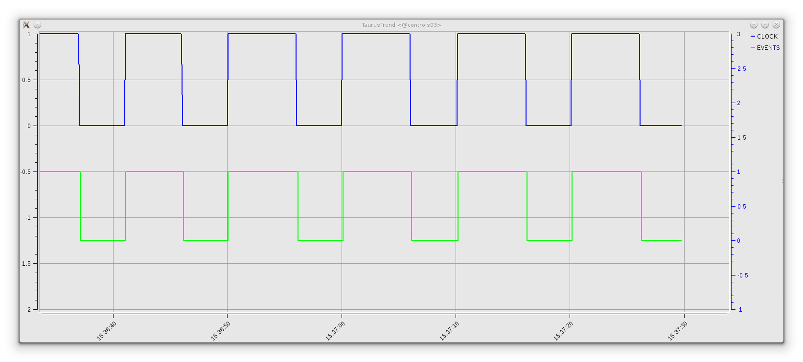
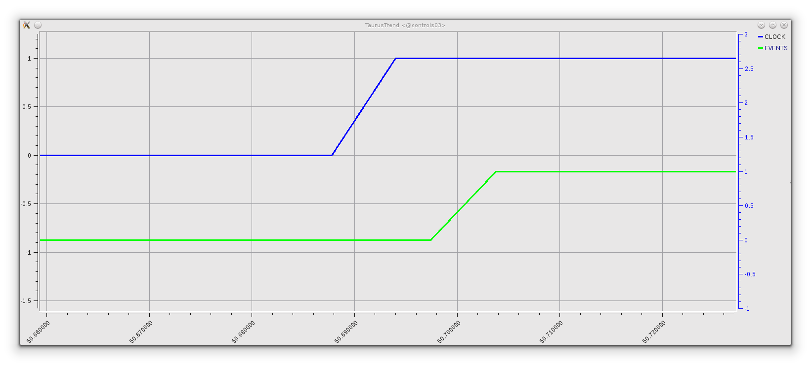

PyAlarm Using Events With Taurus
================================

Setting up a PyAlarm getting Tango events from Taurus
-----------------------------------------------------

We will test events using the CLOCK alarm created in the previous recipe (polling should be enabled, this example uses polling on CLOCK attribute at 10 ms):

  https://github.com/tango-controls/panic/blob/documentation/doc/recipes/CustomAlarms.rst#clock-alarm-triggered-by-time

Then, create a new PyAlarm device and the event-based alarm:

.. code-block:: python

  import fandango as fn
  fn.tango.add_new_device('PyAlarm/events','PyAlarm','test/pyalarm/events')
  
  from panic import AlarmAPI
  alarms = AlarmAPI()
  alarms.add(device='test/pyalarm/events',tag='EVENTS',formula='test/pyalarm/clock/clock')

Start your device server using Astor, fandango or manually

.. code-block:: python

  import fandango as fn
  fn.Astor('test/pyalarm/events').start_servers(host='your_hostname')

Then, configure the device properties to read attributes using Taurus and react as fast as possible
Taurus will take care of subscribing to events and update cached values.

.. code-block:: python

  dtest = alarms.devices['test/pyalarm/events']
  dtest.config['UseTaurus'] = True
  dtest.config['AutoReset'] = 0.05
  dtest.config['Enabled'] = 10
  dtest.config['AlarmThreshold'] = 1
  dtest.config['PollingPeriod'] = 0.05
  alarms.put_db_properties(dtest.name,dtest.config)
  dtest.init()
 
This is the result you can expect when showing both alarm attributes (test/pyalarm/clock/clock and test/pyalarm/events/events) in a taurustrend:
 

Is this approach really Event-Based?
------------------------------------

Yes, but not asynchronously. PyAlarm will use Taurus to catch Tango Events and buffer them; but alarms are still triggered by the internal polling thread of PyAlarm. 
It means that the PyAlarm.PollingPeriod property effectively filters how often incoming events are processed.

But, delegating event collection to Taurus allows to not execute read_attribute in the polling thread; allowing to very small PollingPeriod values (10-20 ms)

As seen in this picture, it allows to have a very fast reaction from the Alarm attributes respect to the trigger:

This approach, however, is costly in terms of cpu usage if using polling periods below 100 ms. A pure-asynchronous event implementation of the PyAlarm is still pending.
